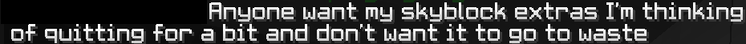
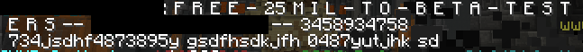
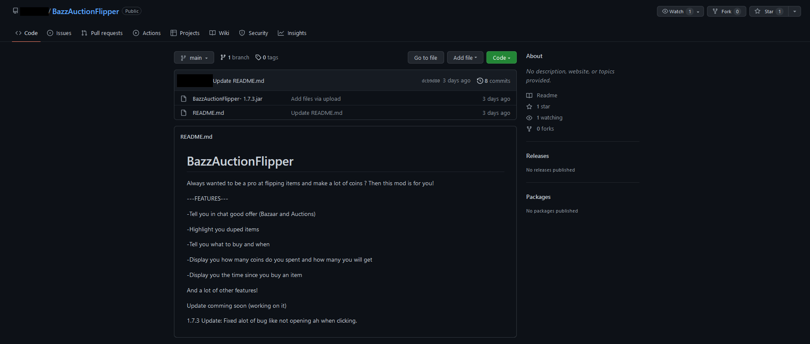
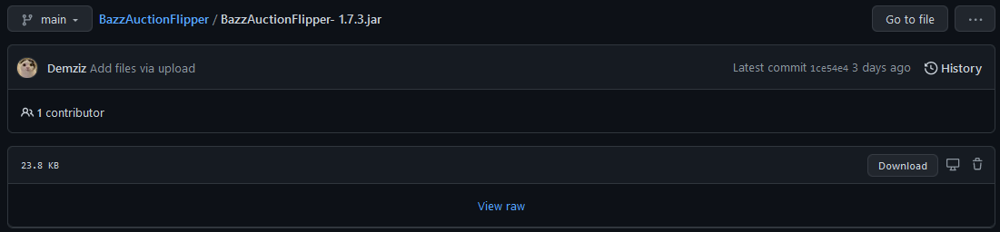
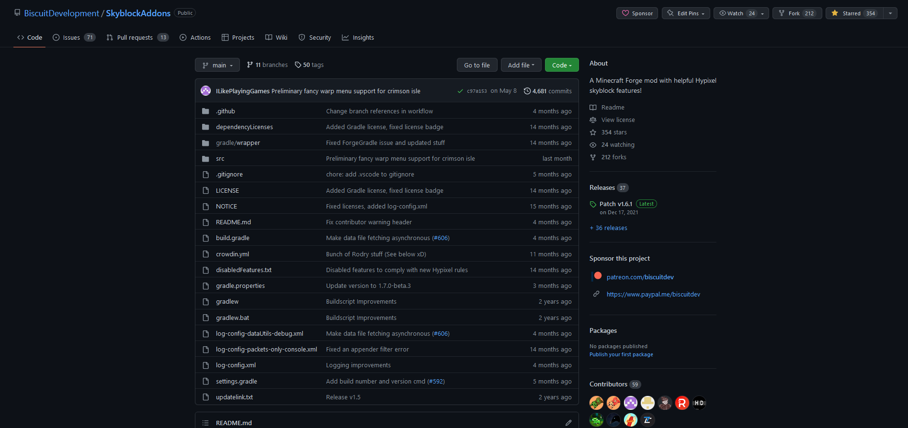
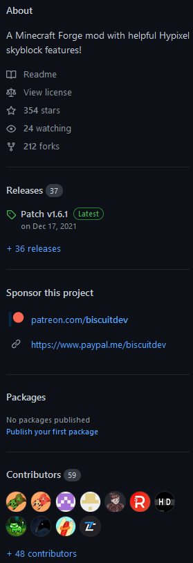
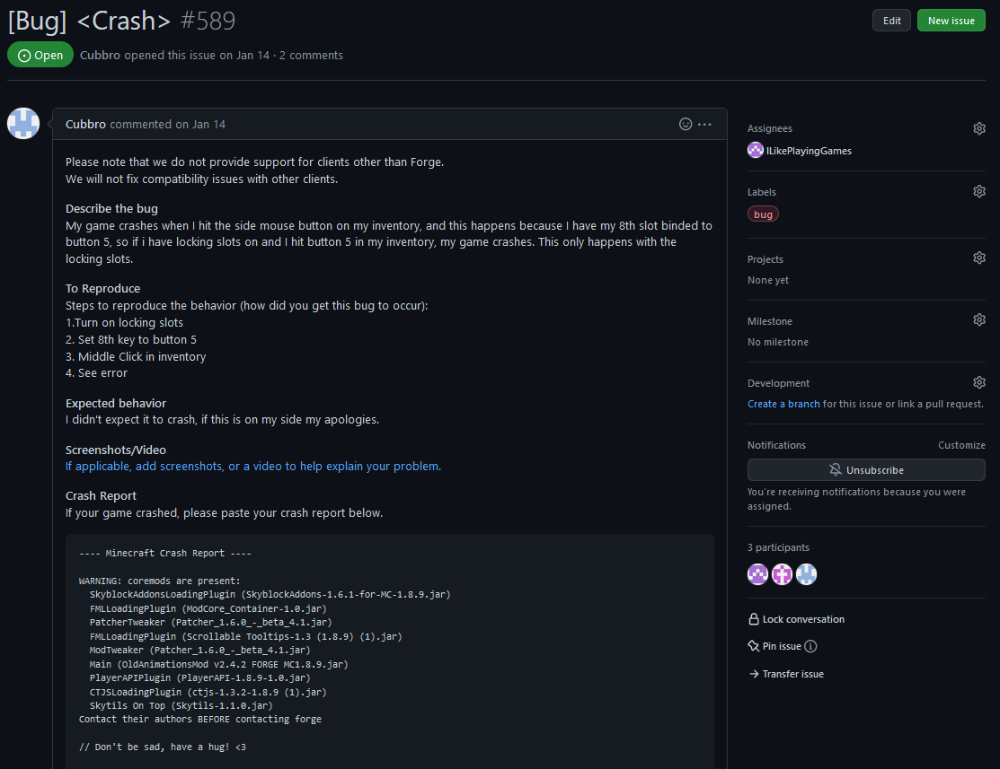
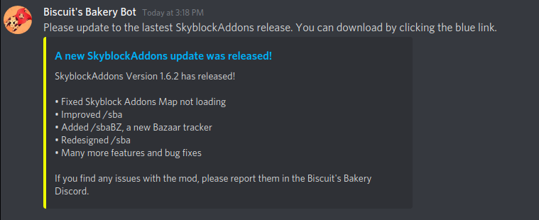
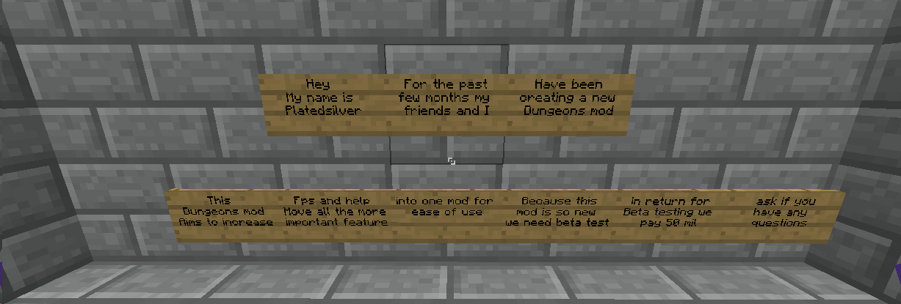

:house: [Home](README.md)
# Common Token Logger Strategies
- Offering paid mods (like SBE) or private mods for free
    - It may seem like a good deal but what sounds too good to be true usually is.
    - Sometimes they may offer to give one to you if you beat them in a duel to make it sound more convincing. These are most likely token loggers.

  

- Token loggers disguised as popular mods
    - Token loggers are usually disguised as a popular mod (like SBA or NEU).
- Offering to pay you to test their mod
    - Sometimes they'll offer to pay you coins to download the mod. This is a ruse since they'll just take over your account after you run the mod.

  
- Impersonating people you trust
    - They have been seen to impersonate high-ranking community members such as staff members from Skyblock Discord communities.
    - They impersonate the owners of accounts they have stolen to convince the owner's friends to download token loggers.
- Offering to send a new update of a mod in DMs
    - Please don't download files from random people.
- Offering hacks with a flashy feature list
    - Don't download hacks at all. They are not allowed on Skyblock and it's difficult to know what's in them. You may get banned or have your account stolen.
    - Token logger makers sometimes disguise their mods as hacks such as macros, auction flippers, and dungeon solvers.
    - They'll advertise impressive features such as making billions of coins in a day. These are fake claims to lure people in.
- Advertising a mod hosted on Github
    - Github is a code sharing site where anyone can upload their code for everyone to see. Being hosted on Github doesn't mean that a mod is safe because anyone can upload to the site.
    - There are certain details that you can use to gauge the legitimacy of a mod on Github. There is no singular detail that guarantees the mod's safety. You should evaluate all of them before making a decision.
        - Github repositories that contain compiled code usually mean that the mod is dangerous. Github repositories are supposed to be used for sharing source code, not compiled code.
            - Files ending in the extensions `.jar`, `.exe`, and `.dmg` are compiled code. Sometimes token logger creators will create a repository with only one or two of these.

          

            - Another sign of compiled code is the presence of a "view raw" link instead of text when you click on the file's name in the list.

          

        - Repositories of legitimate mods will contain source code files and resource files. These typically end with `.java`, `.gradle`, `.json`, `.txt`, `.xml`, etc.
            - Clicking a file name will display the full contents of the file in plain text.
            - This is not a guarantee of safety as more diligent token logger creators will upload fake source code.
            - Example of a legitimate mod repository with source code files:

      

        - Look at the sidebar. Legitimate mods often have high numbers of stars, watchers, forks, releases, and contributors. These are indicators that many people have used and worked on a mod for an extended period of time.

      

        - Look at the issues and pull requests. Legitimate mods often have a number of these. Check for things like detailed descriptions of the issue, logs, comments from other users, and replies form the repository contributors. These details indicate that the issues/pull requests were written by real users of the mod.

      

    - If you're unsure if a mod hosted on Github is safe, ask a staff member in the discord server of one of the most popular Skyblock mods to confirm. They are listed on the [Official Download Links for Skyblock Mods](official-mod-download-links.md) page.
- They are usually high-level players
    - They target high-level players to steal their wealth so they often have high stats themselves to blend in with their prey.
    - They often look for victims in areas high-level players frequent (like Crystal Hollows or F7 dungeon parties).
- Random direct messages
    - They sometimes randomly DM people in Skyblock Discord servers offering to send a mod. Ignore and report these messages to the server staff and Discord.
- Advertising in in-game lobbies
    - They also advertise in Skyblock lobbies like the hub, asking anyone who wants a free mod to message them.
- Playing and talking with victims to gain their trust
    - They will play through several dungeon runs and chat with other players for some time before offering the token logger. They do this to gain trust so people will be more likely to download the token logger.
- Saying the file is marked safe on VirusTotal
    - They use VirusTotal to convince people the file is safe. In reality, this is misleading as VirusTotal cannot detect Minecraft token loggers.
- Pretending to be an official discord bot of a mod and advertising a supposed mod update in DMs
    - Mod creators never share mod updates in DMs. They will always be posted in an announcement channel on the mod's official Discord server

  

- Inviting players to their island and asking them to test mods using sign messages

  
