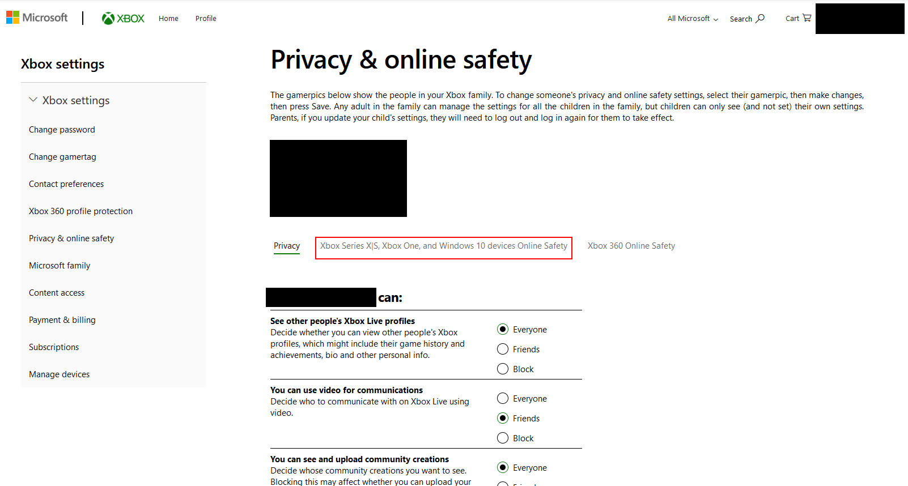
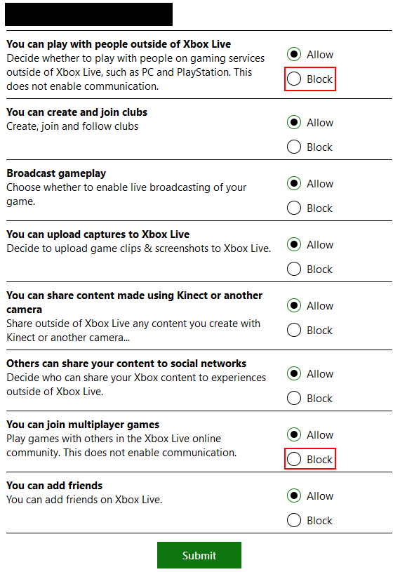

:house: [Home](README.md)
# What to do if You've Been Hacked

1. Disable Multiplayer on your Minecraft account. This prevents the hacker from logging into servers. Your Minecraft account must be a Microsoft account to do this.
   1. Go to your Xbox settings: https://account.xbox.com/settings
   2. Select "Xbox Series X|S, Xbox One, and Windows 10 devices Online Safety"
      
   3. Set the highlighted options to "Block"
      
   4. Click "Submit" to save the changes
2. [Change your Minecraft account password.](https://support.microsoft.com/en-us/account-billing/change-your-microsoft-account-password-fdde885b-86da-2965-69fd-4871309ef1f1)
3. [Change your Discord account password.](https://support.discord.com/hc/en-us/articles/218410947-I-forgot-my-Password-Where-can-I-set-a-new-one-)
4. Change all the passwords stored in your browser as well since token stealers have been known to steal these as well. Please select the browser you're using to be directed to the correct instructions.
   - [Brave](https://support.brave.com/hc/en-us/articles/360018185951-How-do-I-use-the-built-in-password-manager-)
   - [Chrome](https://support.google.com/chrome/answer/95606?hl=en)
   - [Firefox](https://support.mozilla.org/en-US/kb/password-manager-remember-delete-edit-logins)
   - [Microsoft Edge](https://support.microsoft.com/en-us/microsoft-edge/save-or-forget-passwords-in-microsoft-edge-b4beecb0-f2a8-1ca0-f26f-9ec247a3f336)
   - [Safari](https://support.apple.com/en-us/HT211145)
   - [Yandex](https://browser.yandex.com/help/security/passwords-manager.html)
5. If the hacker sent you a mod on Discord, [report the incident](how-to-protect-yourself-from-minecraft-token-loggers.md#in-discord).
6. Check out these resources to protect your account from being compromised in the future.
   - [Hypixel's account security guide](https://support.hypixel.net/hc/en-us/articles/360019538060)
   - [Minecraft: Java Edition Account Security FAQ](https://help.minecraft.net/hc/en-us/articles/4409227755661-Minecraft-Java-Edition-Account-Security-FAQ)
   - [Discord's tips for hacking incidents](https://discord.com/safety/360044104071-Tips-against-spam-and-hacking#Hacking-incidents-DDoS-attacks)
   - [Common Token Logger Strategies](common-token-logger-strategies.md)
-----

# Notes
If the hacker has taken your Skyblock items, unfortunately there is nothing you can do. Hypixel does not restore Skyblock items under any circumstance[^1].
If the hacker has gotten your account banned by hacking on it, unfortunately you'll have to wait out your ban. According to Hypixel, what happens on your account is your responsibility, no matter who was using it[^2].

[^1]: [Lost Skyblock Items](https://support.hypixel.net/hc/en-us/articles/360019584000-Lost-SkyBlock-Items)
[^2]: [Player and Account Safety > Why do we have this rule?](https://hypixel.net/hypixel-rules/#rule-4-section-1)